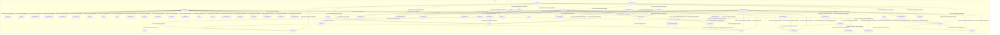

# App Server 进程组合

由 `serve` 以产品配置（`--product-home`）真实装配生成，只含进程层，不含 Agent 实例。重新生成：`cargo run -p xtask -- graph`。

```mermaid
%% Generated from live rutis diagnostics; do not edit.
flowchart LR
  subgraph process["process"]
    p1["root"]
    p2["rutis-loader"]
    p61["Attachments"]
    p60["Questions"]
    p59["PrepareModelHost"]
    p58["ContextCompaction"]
    p57["CommandRules"]
    p56["PromptSources"]
    p55["ShellInput"]
    p54["Recall"]
    p53["Wait"]
    p52["WorkspaceTools"]
    p51["BranchTool"]
    p50["ToolExecution"]
    p49["Permission"]
    p48["ModelProvider"]
    p47["Loop"]
    p46["Prompt"]
    p45["ContextPreparation"]
    p44["ToolRegistry"]
    p43["InputQueue"]
    p42["SessionMethods"]
    p41["TimelineTree"]
    p40["SessionBroadcast"]
    p39["PartRegistry"]
    p38["Transport"]
    p37["Rpc"]
    p36["Connection"]
    p35["UiHost"]
    p34["Collaboration"]
    p33["Agents"]
    p32["CollaborationDirectory"]
    p31["AgentDirectory"]
    p30["PluginManager"]
    p29["CollaborationModelPolicy"]
    p28["HooksSettings"]
    p27["PermissionRules"]
    p26["SkillsCatalog"]
    p25["ExecutionBackend"]
    p24["ExecShellSettings"]
    p23["HostPlatform"]
    p22["ExecutionSettings"]
    p21["Mcp"]
    p20["McpPublication"]
    p19["ModelLog"]
    p18["web"]
    p17["SettingsMethods"]
    p16["Settings"]
    p15["Modality"]
    p14["Provider"]
    p13["GrokOAuth"]
    p12["OpenAICodexOAuth"]
    p11["ManagedProviderMethods"]
    p10["PluginFiles"]
    p9["ManagedProviders"]
    p8["ManagementMethods"]
    p7["SessionStore"]
    p6["SqliteStorage"]
    p5["Aimux"]
    p4["FileStorage"]
    p3["ServerControl"]
  end
  p39 -->|"dim_agent_runtime::parts::PartRegistry"| p61
  p39 -->|"dim_agent_runtime::parts::PartRegistry"| p60
  p39 -->|"dim_agent_runtime::parts::PartRegistry"| p59
  p39 -->|"dim_agent_runtime::parts::PartRegistry"| p58
  p39 -->|"dim_agent_runtime::parts::PartRegistry"| p57
  p39 -->|"dim_agent_runtime::parts::PartRegistry"| p56
  p39 -->|"dim_agent_runtime::parts::PartRegistry"| p55
  p39 -->|"dim_agent_runtime::parts::PartRegistry"| p54
  p39 -->|"dim_agent_runtime::parts::PartRegistry"| p53
  p39 -->|"dim_agent_runtime::parts::PartRegistry"| p52
  p39 -->|"dim_agent_runtime::parts::PartRegistry"| p51
  p39 -->|"dim_agent_runtime::parts::PartRegistry"| p50
  p39 -->|"dim_agent_runtime::parts::PartRegistry"| p49
  p39 -->|"dim_agent_runtime::parts::PartRegistry"| p48
  p39 -->|"dim_agent_runtime::parts::PartRegistry"| p47
  p39 -->|"dim_agent_runtime::parts::PartRegistry"| p46
  p39 -->|"dim_agent_runtime::parts::PartRegistry"| p45
  p39 -->|"dim_agent_runtime::parts::PartRegistry"| p44
  p39 -->|"dim_agent_runtime::parts::PartRegistry"| p43
  p39 -->|"dim_agent_runtime::parts::PartRegistry"| p42
  p39 -->|"dim_agent_runtime::parts::PartRegistry"| p41
  p39 -->|"dim_agent_runtime::parts::PartRegistry"| p40
  p36 -->|"dim_app_server::connection::ConnectionHub"| p38
  p3 -->|"dim_app_server::control::ServerControl"| p38
  p6 -->|"dim_app_server::storage::sqlite::SqliteStorage"| p38
  p33 -->|"dim_app_server::agents::AgentIndex"| p37
  p34 -->|"dim_app_server::collaboration::Collaboration"| p37
  p36 -->|"dim_app_server::connection::ConnectionHub"| p37
  p3 -->|"dim_app_server::control::ServerControl"| p37
  p8 -->|"dim_app_server::methods::ManagementMethods"| p37
  p2 -->|"rutis_loader::loader::Loader"| p37
  p3 -->|"dim_app_server::control::ServerControl"| p36
  p35 -->|"dim_app_server::ui_host::UiHost"| p36
  p39 -->|"dim_agent_runtime::parts::PartRegistry"| p34
  p33 -->|"dim_app_server::agents::AgentIndex"| p34
  p32 -->|"dim_app_server::collaboration::CollaborationDirectory"| p34
  p16 -->|"dim_app_server::settings::SettingsService"| p34
  p39 -->|"dim_agent_runtime::parts::PartRegistry"| p33
  p31 -->|"dim_app_server::agents::AgentDirectory"| p33
  p16 -->|"dim_app_server::settings::SettingsService"| p33
  p6 -->|"dim_app_server::storage::sqlite::SqliteStorage"| p33
  p7 -->|"dim_app_server::storage::timeline::SessionStore"| p33
  p2 -->|"rutis_loader::loader::Loader"| p33
  p39 -->|"dim_agent_runtime::parts::PartRegistry"| p30
  p8 -->|"dim_app_server::methods::ManagementMethods"| p30
  p2 -->|"rutis_loader::loader::Loader"| p30
  p8 -->|"dim_app_server::methods::ManagementMethods"| p29
  p16 -->|"dim_app_server::settings::SettingsService"| p29
  p4 -->|"dim_agent_capabilities::file_storage::FileStorage"| p28
  p8 -->|"dim_app_server::methods::ManagementMethods"| p28
  p16 -->|"dim_app_server::settings::SettingsService"| p28
  p8 -->|"dim_app_server::methods::ManagementMethods"| p27
  p16 -->|"dim_app_server::settings::SettingsService"| p27
  p23 -->|"dim_agent_capabilities::host_platform::HostPlatform"| p26
  p39 -->|"dim_agent_runtime::parts::PartRegistry"| p26
  p8 -->|"dim_app_server::methods::ManagementMethods"| p26
  p16 -->|"dim_app_server::settings::SettingsService"| p26
  p23 -->|"dim_agent_capabilities::host_platform::HostPlatform"| p25
  p8 -->|"dim_app_server::methods::ManagementMethods"| p25
  p23 -->|"dim_agent_capabilities::host_platform::HostPlatform"| p24
  p8 -->|"dim_app_server::methods::ManagementMethods"| p24
  p22 -->|"dim_agent_capabilities::execution_settings::ExecutionSettingsHost"| p23
  p4 -->|"dim_agent_capabilities::file_storage::FileStorage"| p23
  p16 -->|"dim_app_server::settings::SettingsService"| p22
  p4 -->|"dim_agent_capabilities::file_storage::FileStorage"| p21
  p39 -->|"dim_agent_runtime::parts::PartRegistry"| p21
  p20 -->|"dim_app_server::mcp::publication::Publication"| p21
  p8 -->|"dim_app_server::methods::ManagementMethods"| p21
  p16 -->|"dim_app_server::settings::SettingsService"| p21
  p16 -->|"dim_app_server::settings::SettingsService"| p20
  p4 -->|"dim_agent_capabilities::file_storage::FileStorage"| p19
  p16 -->|"dim_app_server::settings::SettingsService"| p19
  p39 -->|"dim_agent_runtime::parts::PartRegistry"| p18
  p16 -->|"dim_app_server::settings::SettingsService"| p18
  p8 -->|"dim_app_server::methods::ManagementMethods"| p17
  p16 -->|"dim_app_server::settings::SettingsService"| p17
  p4 -->|"dim_agent_capabilities::file_storage::FileStorage"| p16
  p6 -->|"dim_app_server::storage::sqlite::SqliteStorage"| p16
  p14 -->|"dim_agent_capabilities::host::ModelSelectionHost"| p15
  p14 -->|"dim_agent_capabilities::host::SelectableModelsHost"| p15
  p8 -->|"dim_app_server::methods::ManagementMethods"| p15
  p16 -->|"dim_app_server::settings::SettingsService"| p15
  p5 -->|"dim_agent_capabilities::host::ModelHost"| p14
  p12 -->|"dim_app_server::codex_oauth::OpenAICodexOAuthService"| p14
  p13 -->|"dim_app_server::grok_oauth::GrokOAuthService"| p14
  p9 -->|"dim_app_server::managed_provider::ManagedProviders"| p14
  p8 -->|"dim_app_server::methods::ManagementMethods"| p14
  p6 -->|"dim_app_server::storage::sqlite::SqliteStorage"| p14
  p4 -->|"dim_agent_capabilities::file_storage::FileStorage"| p13
  p8 -->|"dim_app_server::methods::ManagementMethods"| p13
  p4 -->|"dim_agent_capabilities::file_storage::FileStorage"| p12
  p8 -->|"dim_app_server::methods::ManagementMethods"| p12
  p9 -->|"dim_app_server::managed_provider::ManagedProviders"| p11
  p8 -->|"dim_app_server::methods::ManagementMethods"| p11
  p4 -->|"dim_agent_capabilities::file_storage::FileStorage"| p10
  p6 -->|"dim_app_server::storage::sqlite::SqliteStorage"| p7
```
